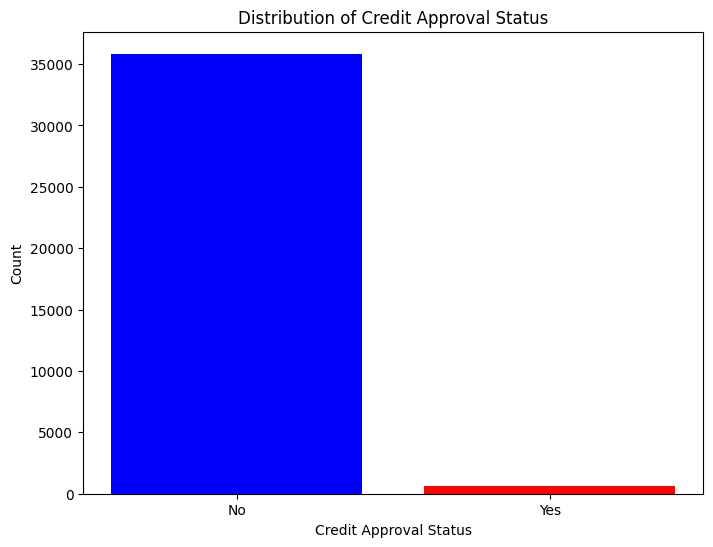
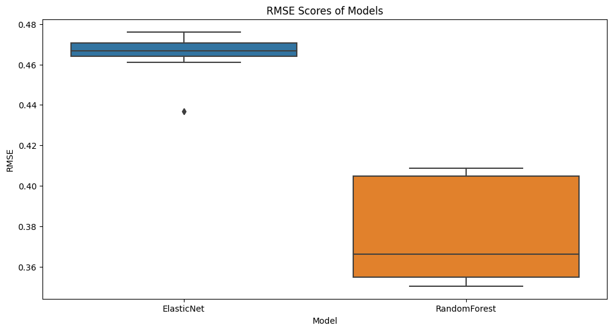

# Credit Card Approval Prediction
## Overview
This project aims to predict credit card approval decisions based on various features related to credit history, financial information, and personal details of applicants. The goal is to build a machine learning model that can accurately predict whether a credit card application will be approved or rejected by the issuing authority.

## Dataset
The dataset used in this project contains historical credit card application data, including both approved and rejected applications. It includes features such as applicant's age, income, credit score, employment status, debt-to-income ratio, and more.

The dataset is stored in the 'data' directory and is split into two files: 'credit_card_applications.csv' and 'credit_card_labels.csv'. The 'credit_card_applications.csv' file contains the feature data, while the 'credit_card_labels.csv' file contains the corresponding labels (0 for rejected and 1 for approved).

## Requirements
To run the code and reproduce the results, you need the dependencies in 'requirements.txt' file.

## Installation
You can install the required packages using the following command:

<pre>
pip install -r requirements.txt
</pre>

This command needs to be run in the terminal after navigating to the directory containing the 'requirements.txt' file.

## Data Preprocessing
Data preprocessing involved handling missing values, converting categorical variables into numerical form, and balancing the target variable using SMOTE technique due to our imbalnce data as following picture.

## Experiments
During the experimentation phase, several models including RandomForest and ElasticNet were evaluated using different hyperparameters. MLflow was used to track the experiments. Performance was evaluated based on RMSE, MAE, and R2 metrics.

## Running the Scripts
All the code and experiments are contained in the Jupyter notebook 'simple_exp_tracking_mlflow.ipynb'. You can run this notebook using Jupyter Notebook or Jupyter Lab.

To start the notebook, navigate to the project directory in the terminal and type 'jupyter notebook' or 'jupyter lab'. This will start the Jupyter server and open a tab in your web browser where you can select and run the notebook.

## MLflow Tracking
Experiments and model performance metrics were logged using MLflow. To view the experiment results, start the MLflow server using the command 

<pre>
mlflow ui --backend-store-uri sqlite:///mlflow.db
</pre>

from the project directory. This will start the MLflow server and provide a local URL that you can open in your web browser to view the experiment results.

## Results and Visualizations
The results of the model evaluations and some visualizations can be found in the 'results' folder. They provide insights into the performance of the models and the importance of different features.

## Folder Structure and File Descriptions
- data: This folder contains the dataset files.
- simple_exp_tracking_mlflow.ipynb: This is the main Jupyter notebook that contains all the code.
- results: This folder contains results and visualizations.
- requirements.txt: This file lists the Python dependencies.

## Conclusion and Future Work

After a thorough analysis of our data and model experimentation using MLflow, the RandomForest model emerged as the best performing model in predicting creditworthiness of individuals.

The RandomForest model performed best with a maximum depth of 10 and 50 estimators. These parameters seem to provide the RandomForest model with a good balance between bias and variance, allowing it to capture complex patterns in the data without overfitting.

Our key performance metrics were RMSE, MAE, and R2, with the RMSE being the primary metric. The best model achieved an RMSE of 0.35, an MAE of 0.235, and an R2 score of 0.509. The RMSE and MAE tell us that our model's predictions are, on average, about 0.35 and 0.235 units away from the true values respectively. An R2 score of 0.509 indicates that about 50.9% of the variance in the target variable can be explained by our model.

The success of the RandomForest model could be attributed to its inherent ability to manage non-linearity in the data. RandomForest, being an ensemble model of decision trees, can capture complex patterns and interactions between variables that linear models may miss.

Despite the promising results, there are potential issues that need to be addressed. For instance, the risk of overfitting is always present, especially when working with complex models like RandomForest. While the model's performance on the test set is quite good, we would need to ensure that it generalizes well to unseen data. Also, RandomForest models can sometimes be biased towards variables with more categories. Therefore, we need to carefully interpret the feature importances provided by the model.

Moving forward, there are several strategies we could adopt to further improve the model:

Experiment with more models: We could try other sophisticated models such as Gradient Boosting Machines or Neural Networks, which might be able to capture more complex relationships in the data.

Feature Engineering: We could engineer more features from the existing data. Feature engineering is an art and often leads to significant improvements in model performance.

Collect more data: More data could potentially improve the model's performance, especially if we can get more data on individuals who have defaulted on their loans.

Hyperparameter tuning: We could explore a wider range of hyperparameters or use more sophisticated hyperparameter optimization techniques such as Bayesian Optimization.

In summary, the project has shown the power of machine learning in predicting creditworthiness. With further refinement, we can improve the model to make even more accurate predictions.